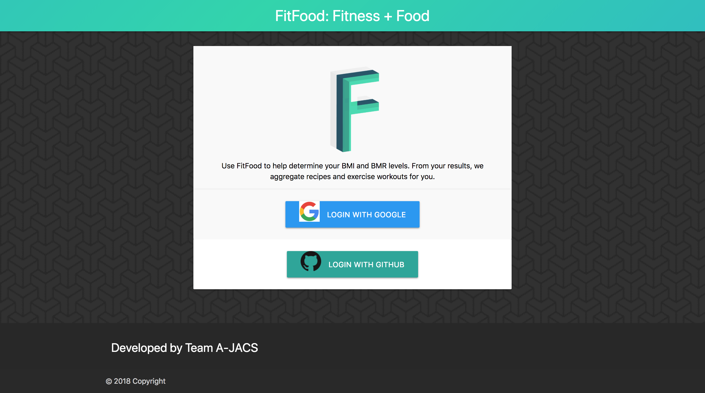

# FitFood
A responsive web app created for Project 1 at Northwestern Coding Boot Camp.

## Demo
Here is a working live demo: https://a-jacs.github.io/Project-FitFood/

## Screenshots

## Tech/framework used

<b>Built with</b>
- [jQuery](https://jquery.com)
- [Firebase](https://firebase.google.com)
- [Bootstrap v4.0](https://getbootstrap.com)
- [MaterializeCSS](http://materializecss.com/)
- [Spoonacular API](https://spoonacular.com/food-api)
- [YouTube API](https://developers.google.com/youtube/)

## License

Northwestern University © [Team A-JACS]()
